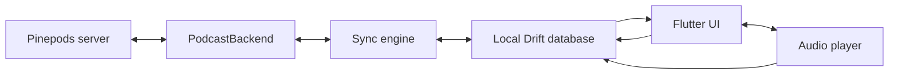

# Architecture

Podpine is organized around a local-first data path:

## Boundaries

- `PodcastBackend` is the provider-neutral contract. `PinepodsBackend` is the first implementation and keeps Pinepods request/response quirks out of the UI.
- `AppDatabase` owns subscriptions, episodes, queue order, and pending mutations. UI streams come from the database, not live HTTP responses.
- `SyncEngine` pushes the mutation outbox before pulling a new server snapshot. This prevents a refresh from immediately replacing a successful offline edit with older remote state.
- `AppController` coordinates the session and optimistic mutations. Network failure does not roll local state back; it adds a retryable outbox entry.
- `PlayerController` owns the playback lifecycle and persists position every 15 seconds plus pause, seek, and episode changes.

## Sync rules in this slice

1. A user action updates SQLite first.
2. If online, the corresponding Pinepods API mutation is attempted immediately.
3. If the call fails, a mutation is written to `sync_mutations`.
4. The next refresh replays mutations oldest-first.
5. Only after the outbox succeeds does the client pull subscriptions, episodes, and queue state.

The next sync iteration should coalesce repeated position entries per episode, add explicit server timestamps/device identifiers where Pinepods exposes them, and use stable fractional ordering plus operation IDs for concurrent offline queue edits.

## Next implementation milestones

1. Add `audio_service` platform integration for lock-screen controls and robust background playback.
2. Add a download manager with resumable jobs, storage accounting, and Wi-Fi policy.
3. Implement Pinepods search, subscribe, and unsubscribe endpoints.
4. Add queue drag/reorder and operation-level conflict handling.
5. Schedule opportunistic refresh with Android WorkManager and iOS BackgroundTasks.
6. Add API fixture tests for Pinepods response variants and migration tests for Drift schema changes.
