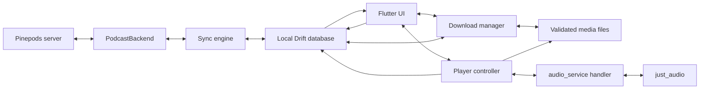

# Architecture

Podpine is organized around a local-first data path:

## Boundaries

- `PodcastBackend` is the provider-neutral contract. `PinepodsBackend` is the first implementation and keeps Pinepods request/response quirks out of the UI.
- `AppDatabase` owns subscriptions, episodes, queue order, and pending mutations. UI streams come from the database, not live HTTP responses.
- `SyncEngine` pushes the mutation outbox before pulling a new server snapshot. This prevents a refresh from immediately replacing a successful offline edit with older remote state.
- `AppController` coordinates the session and optimistic mutations. Network failure does not roll local state back; it adds a retryable outbox entry.
- `PodpineAudioHandler` owns the sole `just_audio` instance and publishes queue, metadata, position, and controls to Android and iOS through `audio_service`.
- `PlayerController` is the UI-facing façade. It maps handler state back to local episodes and persists position every 15 seconds plus pause, seek, and episode changes.
- `DownloadManager` owns device-side media transfers. Drift persists range validators, byte counts, and state; partial files use a separate `.part` path and are promoted only after length validation.
- Playback resolves completed device files before remote media URLs, so downloaded episodes remain playable without connectivity.

## Sync rules in this slice

1. A user action updates SQLite first.
2. If online, the corresponding Pinepods API mutation is attempted immediately.
3. If the call fails, a mutation is written to `sync_mutations`.
4. The next refresh replays mutations oldest-first.
5. Only after the outbox succeeds does the client pull subscriptions, episodes, and queue state.

The next sync iteration should coalesce repeated position entries per episode, add explicit server timestamps/device identifiers where Pinepods exposes them, and use stable fractional ordering plus operation IDs for concurrent offline queue edits.

## Next implementation milestones

1. Add automatic download and retention policies on top of the manual download manager.
2. Add discovery ranking, history, and category browsing refinements.
3. Add operation-level conflict handling for concurrent queue edits.
4. Schedule opportunistic refresh with Android WorkManager and iOS BackgroundTasks.
5. Add API fixture tests for Pinepods response variants and migration tests for Drift schema changes.
